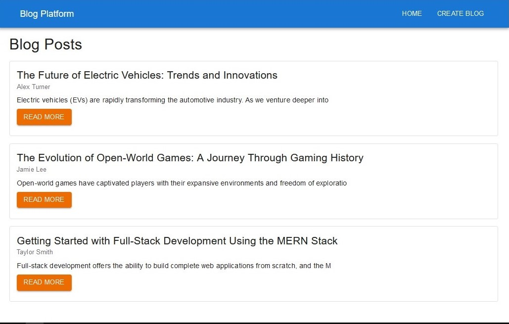

# MERN Stack Blog Platform

Welcome to the **MERN Stack Blog Platform**! This application is a full-stack blogging platform built using the **MERN** stack, which includes MongoDB, Express.js, React, and Node.js.

## 🛠️ Tech Stack

- **Frontend:** React, React Router, Axios
- **Backend:** Node.js, Express.js
- **Database:** MongoDB
- **Styling:** Material UI

## 📸 Screenshot

Here's a glimpse of what the blog platform looks like:

## 🔧 Getting Started

Follow these steps to get the project up and running on your local machine.

### Prerequisites

- [Node.js] (v14.x or higher)
- [MongoDB] (running locally or use a cloud provider like MongoDB Atlas)
- [npm] (comes with Node.js)

### Clone the Repository

git clone https://github.com/umer-shabir/blog-platform
cd blog-platform

### Configuration

Create a `.env` file in the `server` directory with the following variables

MONGODB_URI=your_mongodb_uri
PORT=port_to_run_backend

### For the Server

cd server
npm install
npm run dev

### For the Client

cd client
npm install
npm run dev

Visit `http://localhost:5173` in your browser to access the blog platform.
To view backend API visit `http://localhost:5000/api/blogs` in your browser
